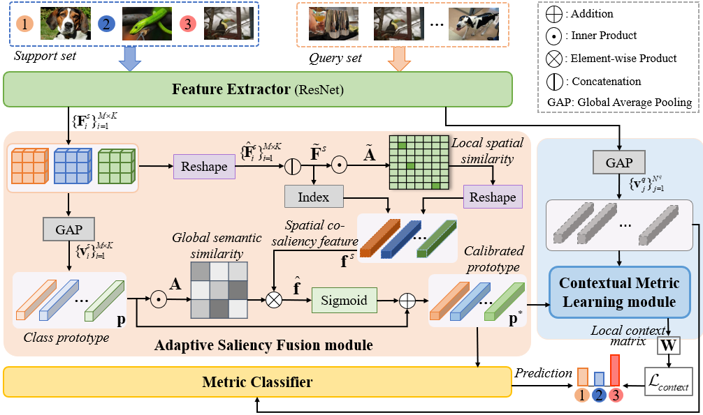
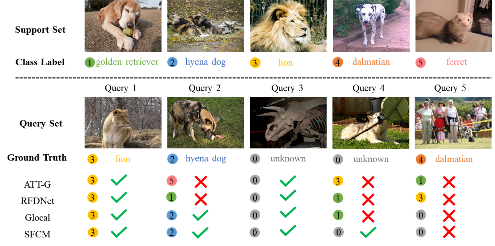

# ASCM：Adaptive Saliency based Contextual Metric Learning 

## Introduction

Few-Shot Open-set Recognition (FSOR) aims to recognize the samples from known classes while rejecting those from unknown (unseen) classes. It faces two primary challenges, including the dynamic changing of decision boundary for known classes due to varying episodes (tasks), and the discriminative ambiguity of visually-similar samples between known and unknown classes, which are not well addressed by previous methods. This inspires us to propose an Adaptive Saliency based Contextual Metric learning framework, termed ASCM. This framework consists of two main components, i.e., adaptive saliency fusion module, and contextual metric learning module. The former adaptively models the importance of foreground saliency
feature according to the global semantic relations among prototype classes, such that the prototypes will be calibrated dynamically across different classes. Meanwhile, the latter captures contextual similarity relation among neighbor embedding features, which alleviates the confusion problem of samples with similar appear.

<p align="center">
     <br>
</p>

## Requirements

This repo is tested with Python 3.8, Pytorch 1.12, CUDA 10.2.

```
conda create -n ascm python=3.8.19
```

```
conda activate ascm
```

```
conda install pytorch==1.12.1 torchvision==0.13.1 torchaudio==0.12.1 cudatoolkit=10.2 -c pytorch
```

More recent versions of Python and Pytorch with compatible CUDA versions should also support the code.
## Dataset Requirements

### MiniImageNet

Dataset Source can be downloaded [here](https://drive.google.com/file/d/12V7qi-AjrYi6OoJdYcN_k502BM_jcP8D/view?usp=sharing)

Download them and move datasets under `data` folder.

```text
data/
└── MiniImageNet/
  │   ├── images/
  │   │   ├── n0153282900000005.jpg
  │   │   ├── n0153282900000006.jpg
  │   │   ├──...
  │   ├── train.csv
  │   ├── val.csv
  │   └── test.csv
  |
```

## Code Structures

- Model: It contains the main files of the code, including the few-shot learning trainer, the dataloader, the network architectures, and baseline and comparison models.
- Data: Images and splits for the data sets.
- Initialization: The pre-trained weights of different networks.
- Checkpoints: To save the trained models.

## Training&Test

### Prepare Pretrain Weights

Download pretrain weights [here](https://drive.google.com/drive/folders/1C9l-0SAw__k3OVRaxXMQ41SoG7RUeEAu?usp=sharing) and move them under `initialization` folder.

### Running

Just run `main.py` for training and testing

For example, to train and test the 5-way 1-shot/5-shot setting on MiniImageNet:

```
python main.py --gpu 0 --max_epoch 100  --open_loss --lr 0.0001 --energy_method sum --pixel_wise --distance pixel_sim  --init_weights [/path/to/pretrained/weights] --dataset MiniImageNet --shot [number of shots] --ahead_combine --top_k [number of k] --method SFCM --lambda_ 0.7
```

or

```
bash train.sh
```

## Quantitative results on MiniImageNet(5-way 1-shot)

| Method | ACC | AUROC
|:----: | :--: | :--------: | 
|ASCM| 69.35±0.65    |    76.51±0.75   |

## Qualitative results

<p align="center">
     <br>
</p>

Qualitative comparison between the baseline and our method(ASCM) on Mini-ImageNet.

## Citation

If you find this repo useful, please cite the following paper.

```
@article{li-pr2026-ascm,
  author    = {Ping Li and Jiajun Chen and Lijie Shang and Chenhao Ping},
  title     = {Adaptive saliency based contextual metric learning for few-shot open-set recognition},
  journal   = {Pattern Recognition (PR)},
  volume    = {175},
  pages     = {113096},
  year      = {2026}
}
```

## Contact

If you have any questions, please contact Mr. Jiajun Chen via email at 241050017@hdu.edu.cn.

## Acknowledgement

We thank the following repositories providing helpful components/functions in our work.
[Glocal](https://github.com/00why00/Glocal), [FEAT](https://github.com/Sha-Lab/FEAT), [SnaTCHer](https://github.com/MinkiJ/SnaTCHer), [TANE](https://github.com/shiyuanh/TANE) and [RFDNet](https://github.com/shule-deng/RFDNet).
